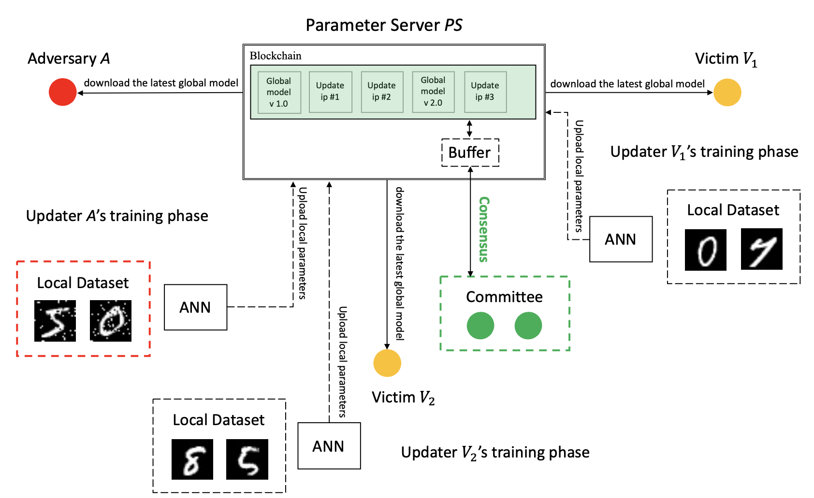

# Blockchain-Based Federated Learning Against End-Point Adversarial Data Corruption

A restored code repository for "Blockchain-Based Federated Learning Against End-Point Adversarial Data Corruption" [paper](https://ieeexplore.ieee.org/document/9356219) (ICMLA20).

<p align="center">

</p>

## Citation
If this repository is helpful for your research or you want to refer the provided results in this work, you could cite the work using the following BibTeX entry:

```
@inproceedings{sun2020blockchain,
  author       = {Yuwei Sun and
                  Hiroshi Esaki and
                  Hideya Ochiai},
  title        = {Blockchain-Based Federated Learning Against End-Point Adversarial Data Corruption},
  booktitle    = {ICMLA},
  pages        = {729--734},
  publisher    = {IEEE},
  year         = {2020}
}
```